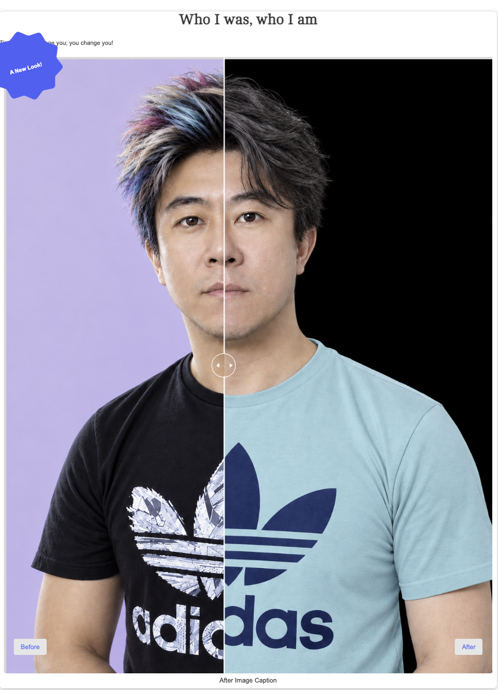
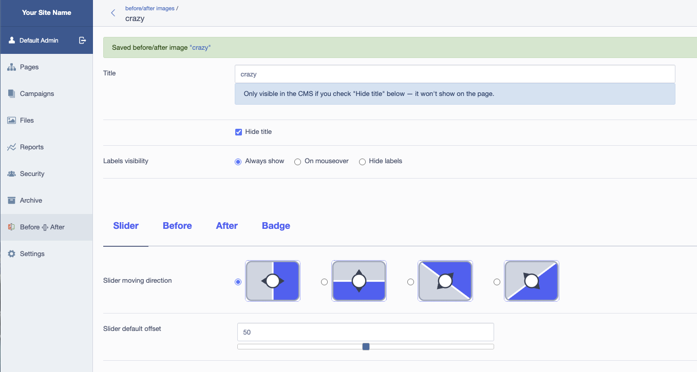
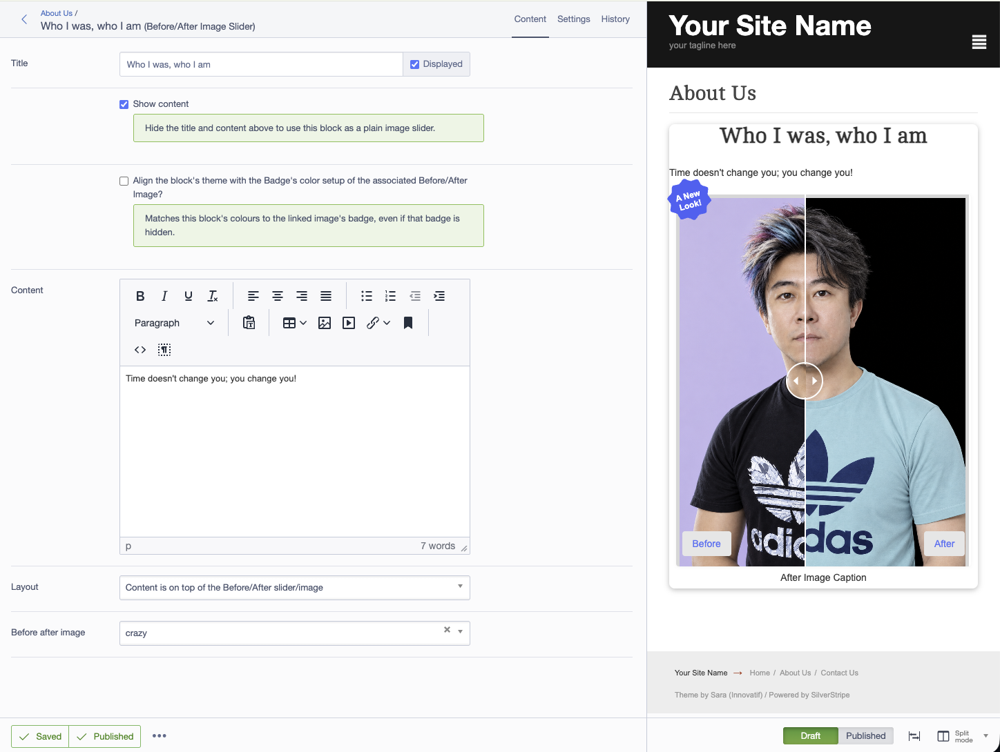

# silverstripe-before-after

[](https://github.com/normann/silverstripe-before-after/actions/workflows/ci.yml)
[](https://packagist.org/packages/normann/silverstripe-before-after)
[](LICENSE)

A draggable **Before/After image comparison slider** for SilverStripe 6 — a `BeforeAfterImage`
DataObject widget (its own CMS section) plus a `BeforeAfterImageBlock` [Elemental](https://github.com/silverstripe/silverstripe-elemental)
block that drops it into any page.

## Screenshots

The slider, on the front end, in its default horizontal direction:



...mid-drag, revealing mostly the "Before" image:


One of the two diagonal directions:


Picking a slider direction in the CMS — each option shows an indicative icon rather than a plain
text label:



Editing the Elemental block, with a live preview alongside:



## Requirements

PHP ^8.3, silverstripe/framework ^6.0, silverstripe/admin ^3.0, dnadesign/silverstripe-elemental
^6.0, unclecheese/display-logic ^4.0, firesphere/rangefield ^1.3,
bimthebam/silverstripe-native-color-input ^1.1. See `composer.json` for exact constraints.

## Installation

```bash
composer require normann/silverstripe-before-after
vendor/bin/sake dev/build flush=1
```

## Usage

**Standalone widget**: CMS → **"Before ‹[]› After"** → add one, set images/slider/labels/badge
across the **Slider**, **Before**, **After** and **Badge** tabs, then reference it from your own
`has_one` and render with `$YourRelationName`.

**Elemental block**: with Elemental installed, **"Before/After Image Slider"** is available in
the block picker. It links to one `BeforeAfterImage`, with an optional title/content in a choice
of four layouts, and can match its own colours to the linked image's badge.

### Configuration options

| Field (on `BeforeAfterImage`) | Purpose |
| --- | --- |
| `SliderDirection` | `horizontal`, `vertical`, `diagonalLeft` or `diagonalRight` |
| `SliderDefaultOffset` | Initial slider position, 0–100 (%) |
| `LabelsVisibility` | `alwaysShow`, `onMouseOver` or `hideLabels` |
| `BeforeLabel` / `AfterLabel` | Text shown on each side |
| `BeforeLabelPosition` / `AfterLabelPosition` | Corner placement (non-vertical sliders) |
| `BeforeLabelPositionVertical` / `AfterLabelPositionVertical` | Left/center/right (vertical slider) |
| `ShowBadge`, `BadgeShape`, `BadgeText`, `BadgeBackgroundColor`, `BadgeTextColor` | Optional badge overlay |

## Contributing / Issues

See [CONTRIBUTING.md](CONTRIBUTING.md). Bug reports and PRs via
[GitHub Issues](https://github.com/normann/silverstripe-before-after/issues).

## License

BSD-3-Clause. See [LICENSE](LICENSE).
